# BikeProduction

## Table of contents

- [General info](#general-info)
- [Screenshots](#screenshots)
- [Technologies](#technologies)
- [Setup](#setup)

## General info

BikeProduction - E-Commerce System.

Swagger:
http://localhost:5000 Identity
http://localhost:5100 CustomerOrder
http://localhost:5101 Catalog
http://localhost:5102 Production
http://localhost:5103 Warehouse 
http://localhost:5104 Delivery
http://localhost:5105 Basket

## Screenshots

Main Page
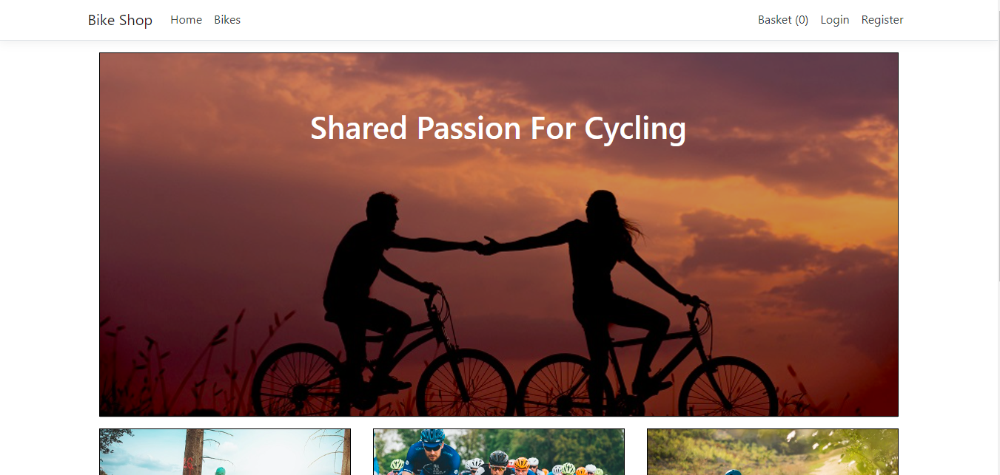

Basket
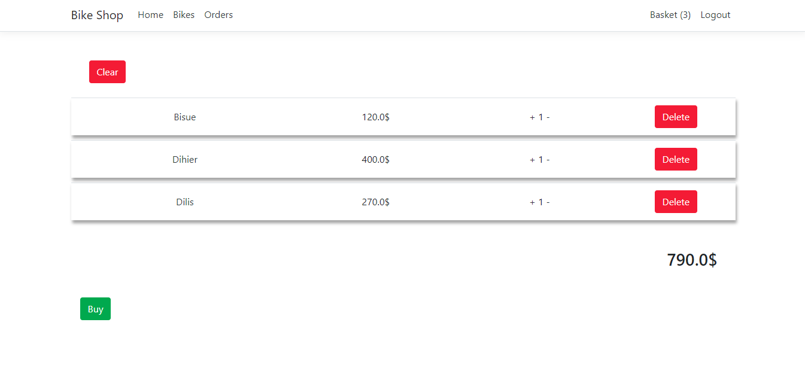

Orders
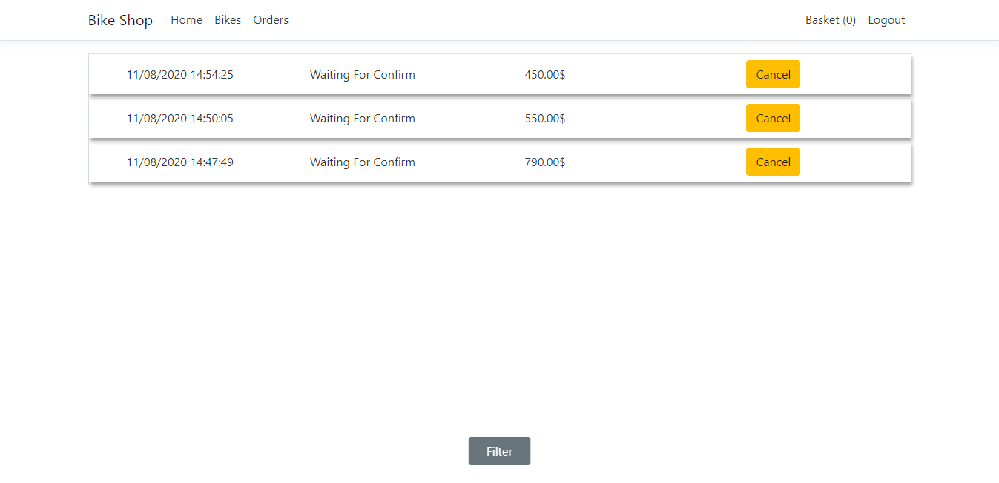

Order Detail
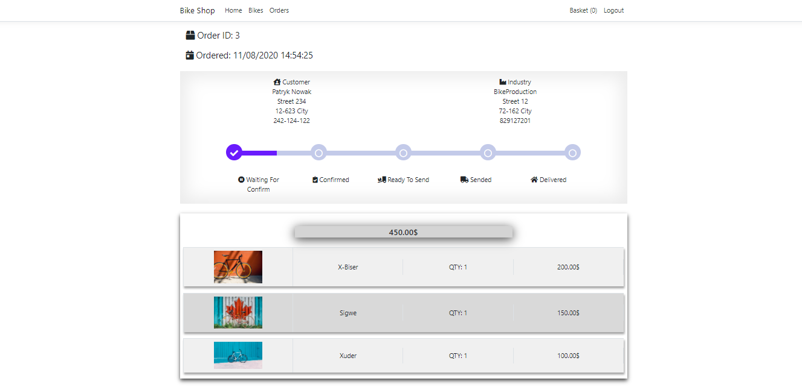

Products
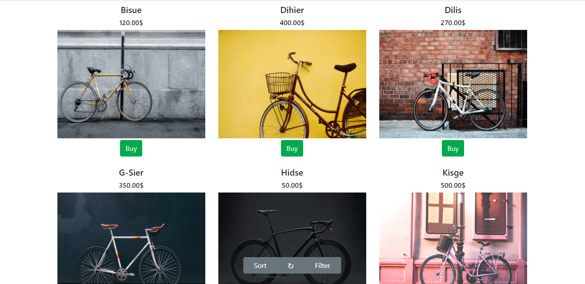

Product Detail
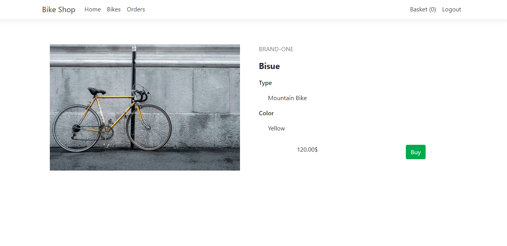

Admin Orders
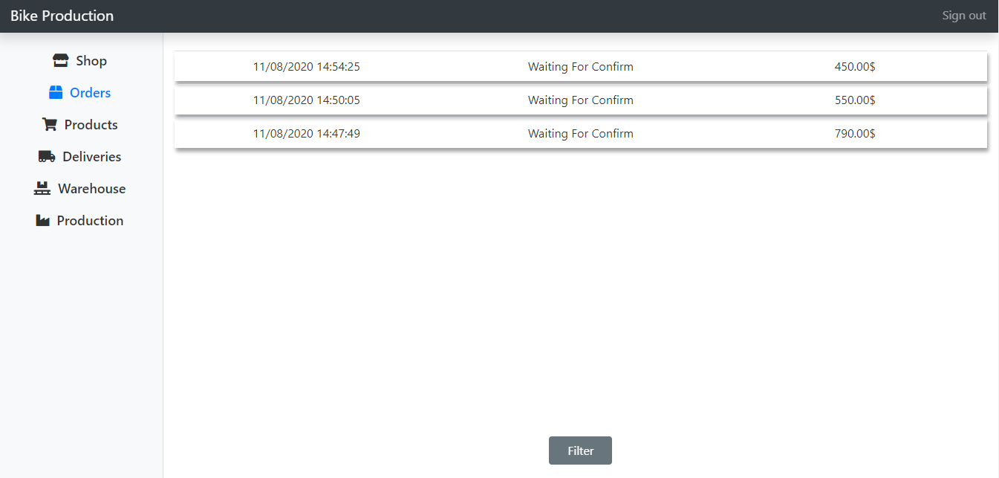

Admin Products
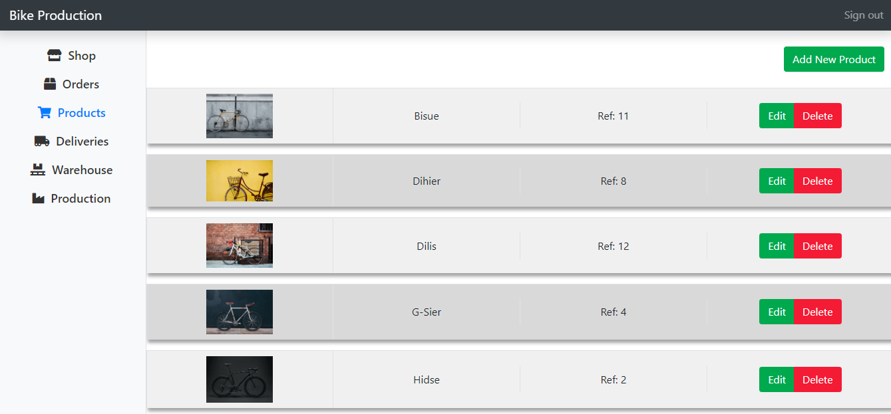

Admin Loading Places
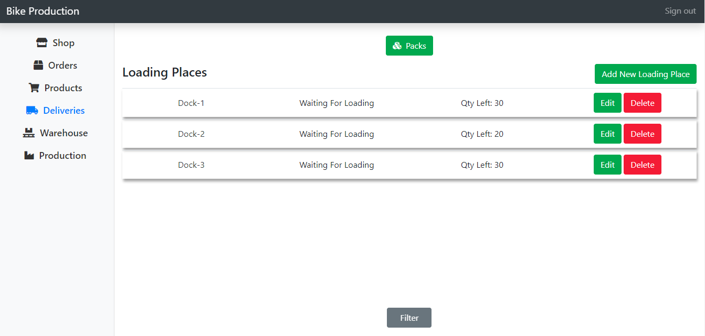

Admin Loading Place Detail
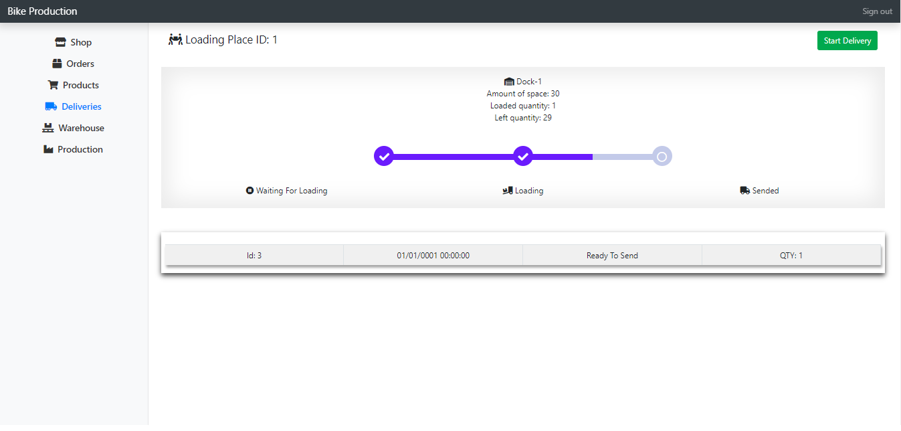

Admin Packs
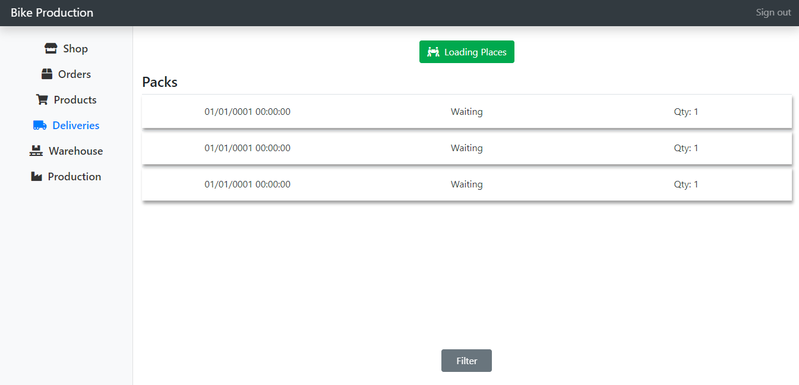

Admin Pack Detail
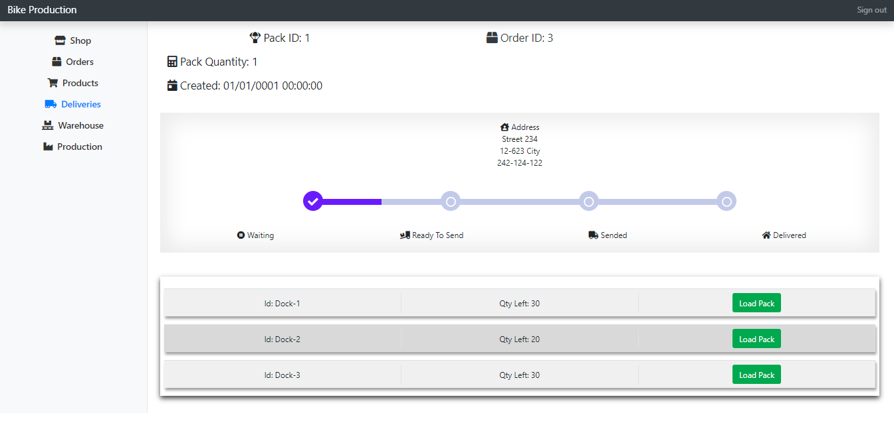

Admin Parts
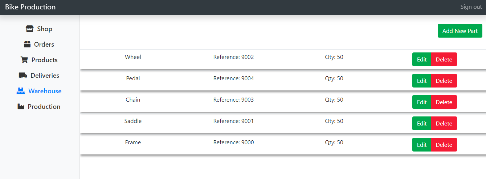

Admin Production Queues
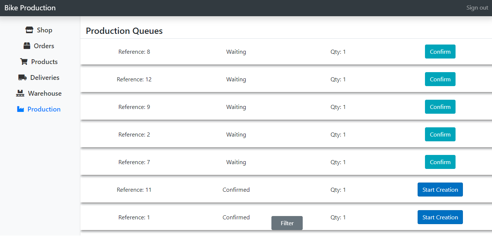

## Technologies

- ASP.NET Core (API & MVC).
- SQL Server.
- Docker.
- Redis.
- RabbitMQ.

## Setup

Requirements:

- Docker

To run App open BikeProduction.sln with Visual Studio, right click on docker-compose Set as Startup Project and press F5.

Passwords:

- Admin:
  admin/Admin123

- User:
  user/User123